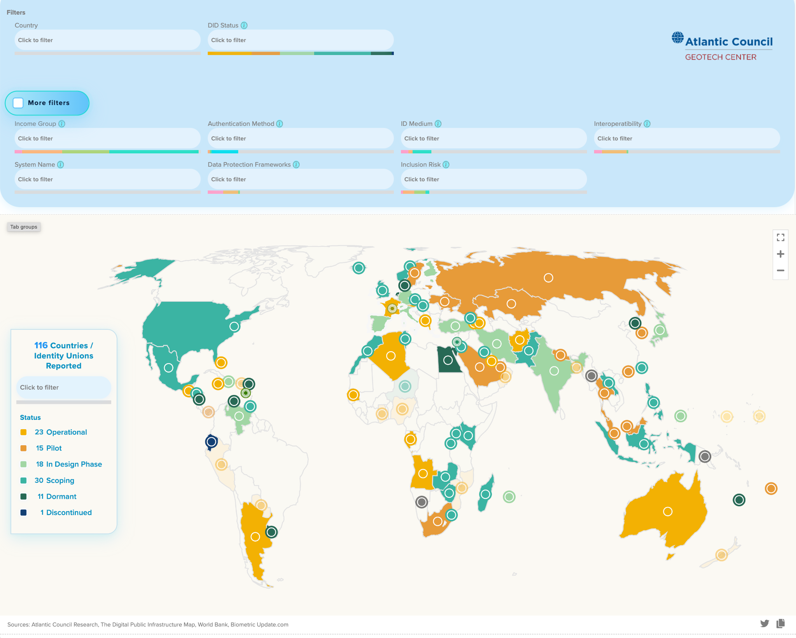

# DIDs Tracker

> The Central Bank Digital Currency Tracker of the Atlantic Council

This is the official code for the [Digital IDs Tracker of the Atlantic Council](https://www.atlanticcouncil.org/blogs/econographics/the-rise-of-central-bank-digital-currencies/)..




## Run locally (for development purposes)

Get the repo.

```bash
git clone https://github.com/GeoTech-AC/DIDs-tracker-svelte.git
cd DIDs-tracker-svelte
```

Install the dependencies. (You need to have [node and NPM installed](https://nodejs.org/en/).)

```bash
npm install
```

Then start [Rollup](https://rollupjs.org):

```bash
npm run dev
```

Navigate to [localhost:5000](http://localhost:5000). You should see your app running.


## Further development

Edit a component file in `src`, save it, and watch localhost.

By default, the server will only respond to requests from localhost. To allow connections from other computers, edit the `sirv` commands in package.json to include the option `--host 0.0.0.0`.

If you're using [Visual Studio Code](https://code.visualstudio.com/) we recommend installing the official extension [Svelte for VS Code](https://marketplace.visualstudio.com/items?itemName=svelte.svelte-vscode). If you are using other editors you may need to install a plugin in order to get syntax highlighting and intellisense.


## Building and running in production mode

To create an optimised version of the app:

```bash
npm run build
```

You can run the newly built app with `npm run start`. This uses [sirv](https://github.com/lukeed/sirv), which is included in your package.json's `dependencies` so that the app will work when you deploy to platforms like [Heroku](https://heroku.com).


## This Svelte app

was initially created by Matthias Stahl, [higsch data & design](https://higsch.com).
